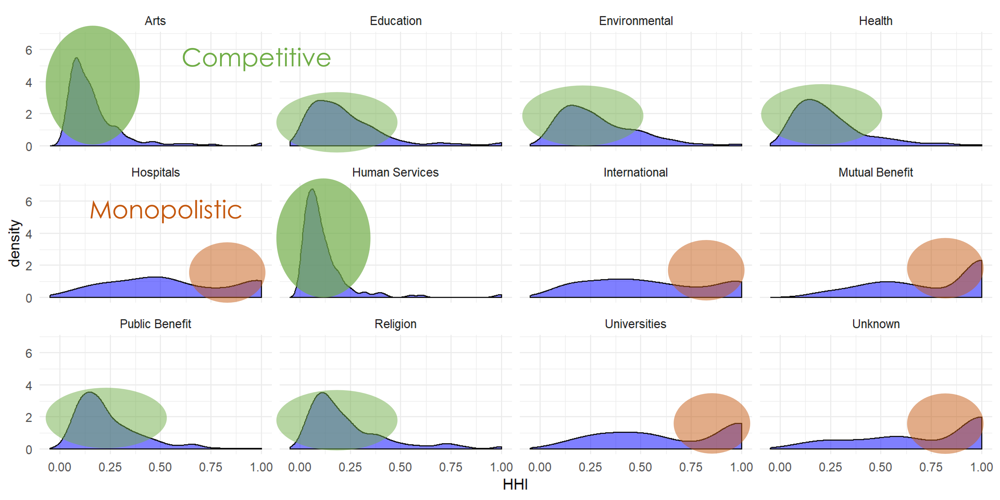

# npcompete

R package to generate metrics describing competition in nonprofit markets. 

```r
devtools::install_github( 'nonprofit-open-data-collective/npcompete' )
library( npcompete )

# compute revenue HHI for metros and subsectors: 

data( nonprofit_sample )
dat.hhi <- get_hhi( df=nonprofit_sample,
                   geo='MSA_NECH',
                   subsector='NTMAJ12',
                   resource='TOTREV'
                   resource.name='Revenue' )
                   
head( dat.hhi )
```




The package will generate the following competition metrics: 

* HHI 
* Normalized HHI 
* CR1 to CR8 
* kindex
* gini coefficient 
* density rate (nonprofits per capita)  
* density of small nonprofits
* "density of large nonprofits  
* "density of commercial nonprofits

... 

To access the pre-compiled **np-compete.csv** dataset in the **data-share** folder. 
